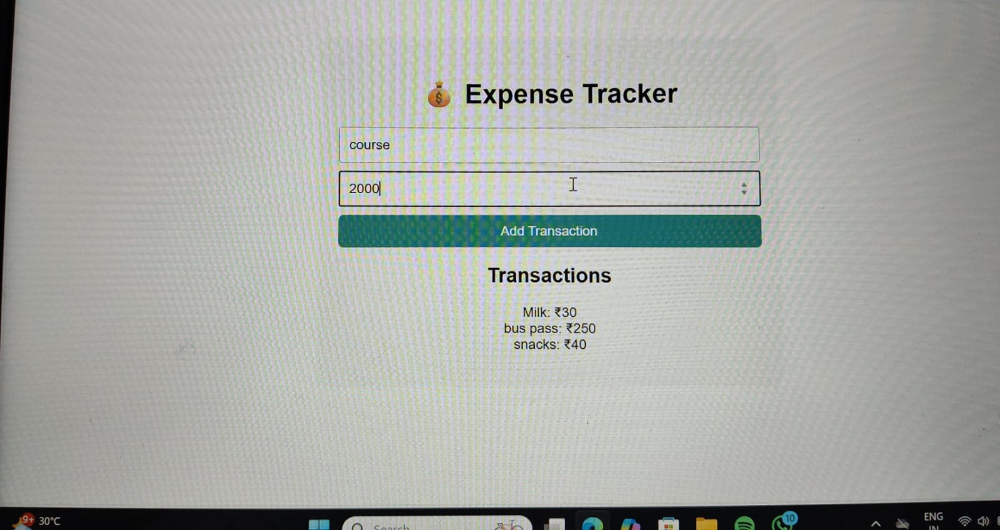

💰 React Expense Tracker

A simple and elegant Expense Tracker web application built using ReactJS and Vite

This app allows users to add, view, and track personal expenses with a minimal UI and smooth functionality. Built with beginner-friendly logic and clean component-based architecture.

🚀 Features

- 📌 Add transactions with a title and amount
- 🧾 View all transactions in a list
- 💡 Uses `useState()` and props to manage data
- 🖼️ Screenshot image of the app for quick preview

🛠️ Tech Stack

- Frontend: ReactJS + Vite
- CSS: Basic styling (can be extended)
- Deployed on: Replit

🔗 Live Preview

👉 [Click here to open the app on Replit](https://your-replit-live-link)

 📸 Screenshot

📁 Project Structure
react-expense-tracker/
├── public/
├── src/
│ ├── App.jsx
│ ├── AddTransactionForm.jsx
├── index.html
├── package.json
├── README.md
├── screenshot.png.jpg

📦 How to Run Locally

1. Clone this repo  
   git clone https://github.com/Nallamachkeerthi/react-expense-tracker.git

2. Install dependencies  
   npm install

3. Run the app  
   npm run dev

 Author

👩🏻‍💻 Keerthi Nallamachu  
🔗 [GitHub Profile](https://github.com/Nallamachkeerthi)

